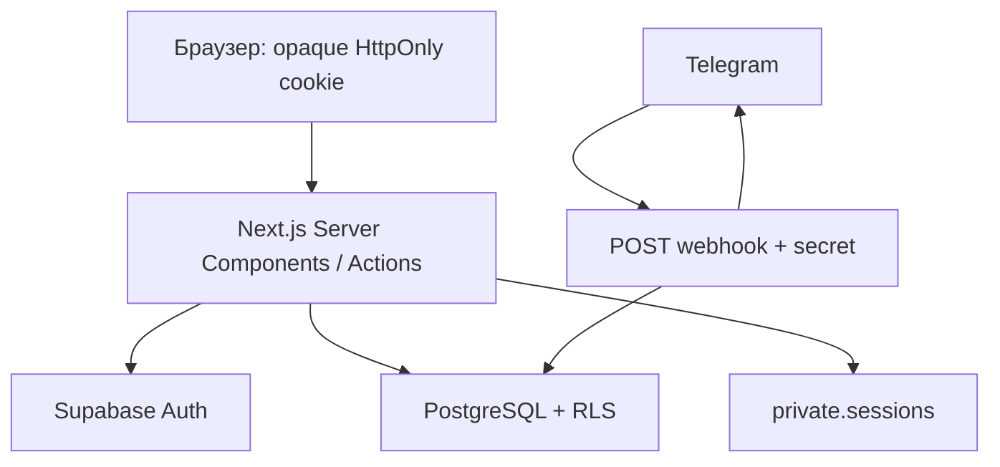

# Архитектура

Один Next.js App Router repository, Node 24, Vercel Functions. Server Components получают данные через feature queries/services. Интерактивные формы, мобильная навигация, Radix dialogs и Recharts работают на клиенте. Мутации — Server Actions с Zod и проверкой роли.

`src/proxy.ts` обновляет сессии и делает предварительный role redirect. `requireRole` на серверных страницах/actions повторно проверяет identity через `getUser`. Proxy не заменяет RLS. Защищённые layouts `force-dynamic`; пользовательские ответы не кешируются публично.

Три Supabase клиента: browser anonymous (`client.ts`), cookie SSR (`server.ts`), server-only service (`admin.ts`). SSR cookies адаптированы к серверному vault: браузер не получает технический email даже внутри JWT. Service key используется в узких операциях регистрации/бота/vault, а пользовательские чтения и admin UI writes — authenticated client под RLS.

Регистрация атомарна: `Admin API createUser` → `auth.users` trigger → consume token + profile + auth alias + application status в одной PostgreSQL транзакции. Для reset token claim и Auth API нельзя создать общую транзакцию: используется безопасное at-most-once погашение; при сбое запрашивается новая ссылка.

Статистика сохраняет интерфейс `StatisticsQuery → StatisticsResult` и читает проведённые `lessons` через authenticated Supabase под RLS. Длительность распределяется по локальным дням в сохранённом МСК-сдвиге зрителя; count относится к началу, заработок — к текущей глобальной ставке. Запросы выбирают пересечение интервалов и постранично читают все записи, включая продолжения с прошлой недели.

`features/schedule/page.tsx` — Server Component. `queries.ts` получает собственное расписание, безопасные имена и доступные варианты формы. Client Components в `components/schedule` реализуют сетку, Pointer Events, выделение, dialogs и меню. Каноническая неделя хранится в `?week=YYYY-MM-DD`; необязательный `day` сохраняет мобильный выбор. Native History API синхронизирован с Next Router; неделя и Back/Forward меняют только локальное отображение. Границы дней вычисляются явно: UTC+3 плюс пользовательский сдвиг, без timezone браузера.

Server Actions проверяют identity/роль и Zod, затем работают через authenticated client. Создание и редактирование используют owner-checked SECURITY DEFINER `save_schedule_lesson`: занятие и приватная заметка сохраняются одной транзакцией под RLS. Заметка загружается лениво только для собственного редактора tutor/admin. Student DTO не содержит заметок. Все пользовательские операции применяются оптимистически с блокировкой повторной отправки и откатом при ошибке. Exclusion constraints обеспечивают защиту от конкурирующих пересечений независимо от UI.

Слои: `app` — маршруты; `features` — actions, queries, services; `components` — интерфейс; `lib` — интеграции, security и validation; `supabase/migrations` — источник истины схемы.

## Канонические инварианты расписания

- SQL resolver проверяет полный интервал tutor + student, шаг 5 минут, поздний вариант при равенстве; старт в выбранном локальном дне до 23:55, окончание может перейти через полночь. Exclusion constraints и ограниченные retry защищают конкурирующие записи.
- Клиентский preview вызывает placeGroup по загруженным занятиям без перемещаемой группы, с учётом conflict class. Нет свободного положения группы — нет target/мутации, один toast после drop. Скрытые student-конфликты остаются исключительно серверными. UI принимает normalized result.lessons/rules/offset, при серверном сдвиге показывает информационный toast.
- Обычное создание/paste разрешено только в текущей неделе UTC+3+offset; dedicated transfer — в текущей или следующей реальной неделе; редактор ограничен семью днями недели занятия; drag в прошлое допустим, в будущую неделю — нет.
- Вся история читается пакетами по 500, имена — батчами. Навигация и CRUD не вызывают refresh/revalidatePath. Минутный polling updated_at с 10-минутным перекрытием работает отдельно и защищён lock + revision guard.
- Save/patch возвращают lesson без note; delete — фактически удалённые IDs. Owner-checked SECURITY DEFINER RPC атомарно сохраняют lesson+note. Прямые writes lessons/notes для authenticated отозваны; admin не пишет чужое расписание.
- Hard delete предмета атомарно удаляет текущие связи, сохраняет lessons с nullable subject_id и subject_name_snapshot. Статистика и заметки не теряются.
- Cron каждые 5 минут копирует валидные занятия предыдущей локальной недели, не перемещая историю: новые IDs, completed_at=NULL, прежние цвет/длительность/заметка. Идемпотентность по (tutor_id,target_week_start); невалидные связи пропускаются, конфликт разрешается magnet либо безопасным skip.
- Schedule writers, hard-delete и rollover используют общий transaction advisory lock. При росте нагрузки измерять latency. Полная межвкладочная синхронизация удалений и восстановление цепочки пропущенных Cron-недель не входят в текущий пакет.

## Клиентские состояния

Календарь постоянно показывает saved/saving/error. Все мутации, включая LessonDialog и offset, участвуют в общем статусе. Optimistic rollback оставляет error до успешной записи; локальная валидация формы до запроса статус не меняет.

DirectoryFilters оставляет получение/фильтрацию данных в PeoplePage (Server Component). Поиск откладывается на 300 мс; select применяет полный текущий draft сразу. useAutoFilters строит URL из синхронного ref, отменяет предыдущий timer, использует router.replace. Ответ собственного перехода не затирает более новый ввод; Back/Forward восстанавливают контролы. StatisticsView не remount-ится на каждый ответ: невалидная пара дат остаётся локальной, валидная применяется сразу; preset удаляет from/to.

Общие loading-кнопки и визуальные правила — [UI](ui-guidelines.md). Текущее [ТЗ](TZ_TutorGate_008_schedule_features_and_fixes.md) и [фактические проверки](verification.md).

## Расписание 008

Общий Server Action scheduleCommandAction валидирует Zod и identity, затем вызывает owner-checked public.schedule_command. Move, delete, color, completed, transfer, availability, paste, create/edit, offset и restore выполняются одной транзакцией под общим advisory lock. Источники transfer остаются неактивными; targets имеют новый UUID, скопированную note, completed=false и отдельный transfer marker. Повторная команда переноса target запрещена; обычный drag разрешён в пределах общих правил.

Четыре partial GiST constraints отделяют active normal от active coral по tutor и student; inactive исключены. Серверный и клиентский magnet ищут один общий delta группы (шаг 5 минут, поздний вариант при равенстве), сохраняя относительные дни, время и длительности. Скрытые конфликты ученика остаются серверными.

Calendar применяет optimistic состояние до запроса, закрывает dialog после локальной валидации, блокирует повторные мутации и принимает canonical result.lessons/rules/offset. Ошибка возвращает предыдущие данные/выделение/offset, а create/edit — ещё и введённый draft. Saved/error не сбрасывается закрытием dialog.

Undo/redo живёт только в памяти смонтированного календаря. Сервер подписывает before/after снимки только затронутых строк, заметок, правил и offset; ключ хранится в закрытой private.schedule_signing_key. Restore проверяет подпись, владельца, область изменений и совпадение expected с текущими данными; сторонние изменения затронутых строк инвалидируют историю. Подпись нельзя получить через private RPC. Восстановление UUID, исторического предмета, заметок и статусов атомарно; exclusion constraints сохраняют силу. Незатронутые серверные строки не перезаписываются. Background sync не добавляется в историю.

Внутренний clipboard хранит выбранные source IDs и геометрию. Ctrl+C не записывает персональные данные в системный clipboard. Ctrl+V требует выбранной точки текущей недели, сервер копирует актуальные приватные заметки по owned source IDs. Rollover пропускает transferred sources, учитывает availability, очищает transfer metadata у recurring copies.
