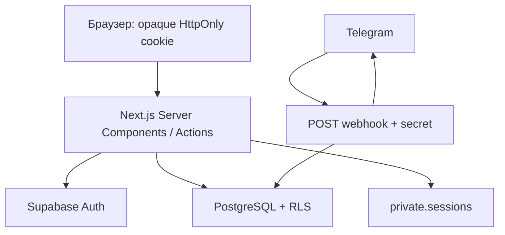

# Архитектура

Один Next.js App Router repository, Node 24, Vercel Functions. Server Components получают данные через feature queries/services. Интерактивные формы, мобильная навигация, Radix dialogs и Recharts работают на клиенте. Мутации — Server Actions с Zod и проверкой роли.

`src/proxy.ts` обновляет сессии и делает предварительный role redirect. `requireRole` на серверных страницах/actions повторно проверяет identity через `getUser`. Proxy не заменяет RLS. Защищённые layouts `force-dynamic`; пользовательские ответы не кешируются публично.

Три Supabase клиента: browser anonymous (`client.ts`), cookie SSR (`server.ts`), server-only service (`admin.ts`). SSR cookies адаптированы к серверному vault: браузер не получает технический email даже внутри JWT. Service key используется в узких операциях регистрации/бота/vault, а пользовательские чтения и admin UI writes — authenticated client под RLS.

Регистрация атомарна: `Admin API createUser` → `auth.users` trigger → consume token + profile + auth alias + application status в одной PostgreSQL транзакции. Для reset token claim и Auth API нельзя создать общую транзакцию: используется безопасное at-most-once погашение; при сбое запрашивается новая ссылка.

Статистика сохраняет интерфейс `StatisticsQuery → StatisticsResult` и читает проведённые `lessons` через authenticated Supabase под RLS. Длительность распределяется по локальным дням в сохранённом МСК-сдвиге зрителя; count относится к началу, заработок — к текущей глобальной ставке. Запросы выбирают пересечение интервалов и постранично читают все записи, включая продолжения с прошлой недели.

`features/schedule/page.tsx` — Server Component. `queries.ts` получает собственное расписание, безопасные имена и доступные варианты формы. Client Components в `components/schedule` реализуют сетку, Pointer Events, выделение, dialogs и меню. Каноническая неделя хранится в `?week=YYYY-MM-DD`; необязательный `day` сохраняет мобильный выбор. Native History API синхронизирован с Next Router; неделя и Back/Forward меняют только локальное отображение. Границы дней вычисляются явно: UTC+3 плюс пользовательский сдвиг, без timezone браузера.

Server Actions проверяют identity/роль и Zod, затем работают через authenticated client. Создание и редактирование используют owner-checked SECURITY DEFINER `save_schedule_lesson`: занятие и приватная заметка сохраняются одной транзакцией под RLS. Заметка загружается лениво только для собственного редактора tutor/admin. Student DTO не содержит заметок. Быстрые операции применяются оптимистически с блокировкой повторной отправки и откатом при ошибке. Exclusion constraints обеспечивают защиту от конкурирующих пересечений независимо от UI.

Слои: `app` — маршруты; `features` — actions, queries, services; `components` — интерфейс; `lib` — интеграции, security и validation; `supabase/migrations` — источник истины схемы.

## Актуальные правила schedule upgrade 006
- Предмет удаляется физически через admin RPC delete_subject_hard: assignments → tutor_subjects → application_subjects → subjects, атомарно. Lessons остаются с nullable subject_id ON DELETE SET NULL и subject_name_snapshot. Пока предмет существует, отображается текущее имя; после удаления — исторический snapshot. Статистика и заметки сохраняются.
- Вся история календаря загружается при открытии пакетами по 500; имена также батчами. Неделя/день — локальное состояние + History API. Навигация и CRUD не вызывают router.refresh или revalidatePath. Force-dynamic статистика читает актуальные данные при заходе.
- Save/patch возвращают нормализованный lesson без note, delete — фактически удалённые IDs. Заметки загружаются отдельно только владельцу. Общие сообщения — единый Toaster, ошибки полей остаются inline.
- Один private SQL magnet resolver: ближайший полный свободный интервал tutor+student, шаг 5 мин, при равенстве расстояний — позже. Start остаётся в выбранном дне (последний старт 23:55), окончание может выйти за полночь. Exclusion constraints сохранены; ограниченные retry защищают от гонок.
- Ручное создание — только текущая локальная неделя (UTC+3+сохранённый offset). Диалог редактирования ограничен семью днями недели карточки; drag может идти в прошлое, но не в будущую неделю. Все ограничения повторяются на сервере.
- Owner-checked SECURITY DEFINER RPC сохраняют lesson+note атомарно. Прямые INSERT/UPDATE/DELETE lessons/notes для authenticated отозваны. Роль admin не даёт права писать в чужой календарь. Private helpers не доступны anon/authenticated, private schema не экспонируется.
- Cron каждые 5 минут копирует валидные занятия предыдущей локальной недели. Новые IDs, completed_at=NULL, прежние цвет/длительность/заметка. История не перемещается. Idempotency: (tutor_id,target_week_start). Удалённые предметы и снятые назначения не копируются; конфликт использует magnet или записывается как безопасный skip.
- Все schedule writers, hard-delete и rollover сериализованы одним transaction advisory lock. Это консервативная стратегия для конфликтов общего student; при высокой нагрузке нужно измерять latency и длительность Cron.
- Видимый календарь раз в минуту читает только обновлённые строки по updated_at cursor с 10-минутным перекрытием. Это независимый от навигации инкремент для автокопий репетиторов с разными offset, а не повторный all-history preload. In-flight polling не перезаписывает мутации: lock + revision guard. Полная межвкладочная realtime-синхронизация удалений не входит в релиз.
- UI: Select/Combobox с portal и поиском, Tooltip, Toaster; native selects убраны. Numeric spinners скрыты, min/max/step сохранены. Заметка 88–240px с auto-grow и внутренней прокруткой. Completed — зелёный Lucide CircleCheck. Undo/Redo только disabled icons.

Фактическая проверка этой ревизии: docs/verification.md (для файлов в docs — verification.md). Старые результаты CI не подтверждают новую ревизию.
