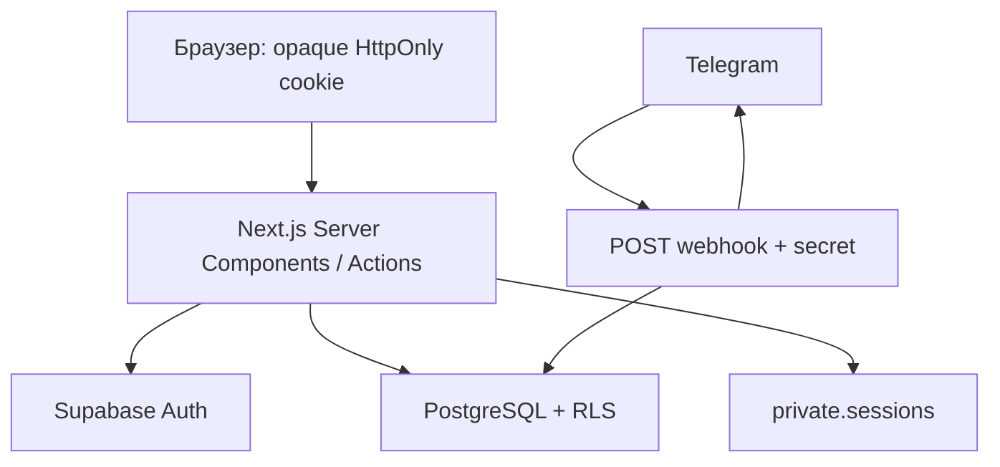

# Архитектура

Один Next.js App Router repository, Node 24, Vercel Functions. Server Components получают данные через feature queries/services. Интерактивные формы, мобильная навигация, Radix dialogs и Recharts работают на клиенте. Мутации — Server Actions с Zod и проверкой роли.

`src/proxy.ts` обновляет сессии и делает предварительный role redirect. `requireRole` на серверных страницах/actions повторно проверяет identity через `getUser`. Proxy не заменяет RLS. Защищённые layouts `force-dynamic`; пользовательские ответы не кешируются публично.

Три Supabase клиента: browser anonymous (`client.ts`), cookie SSR (`server.ts`), server-only service (`admin.ts`). SSR cookies адаптированы к серверному vault: браузер не получает технический email даже внутри JWT. Service key используется в узких операциях регистрации/бота/vault, а пользовательские чтения и admin UI writes — authenticated client под RLS.

Регистрация атомарна: `Admin API createUser` → `auth.users` trigger → consume token + profile + auth alias + application status в одной PostgreSQL транзакции. Для reset token claim и Auth API нельзя создать общую транзакцию: используется безопасное at-most-once погашение; при сбое запрашивается новая ссылка.

Статистика сохраняет интерфейс `StatisticsQuery → StatisticsResult` и читает проведённые `lessons` через authenticated Supabase под RLS. Длительность распределяется по локальным дням в сохранённом МСК-сдвиге зрителя; count относится к началу, заработок — к текущей глобальной ставке. Запросы выбирают пересечение интервалов и постранично читают все записи, включая продолжения с прошлой недели.

`features/schedule/page.tsx` — Server Component. `queries.ts` получает собственное расписание, безопасные имена и доступные варианты формы. Client Components в `components/schedule` реализуют сетку, Pointer Events, выделение, dialogs и меню. Каноническая неделя хранится в `?week=YYYY-MM-DD`; необязательный `day` сохраняет мобильный выбор. Native History API синхронизирован с Next Router; новая неделя и Back/Forward обновляют серверные данные. Границы дней вычисляются явно: UTC+3 плюс пользовательский сдвиг, без timezone браузера.

Server Actions проверяют identity/роль и Zod, затем работают через authenticated client. Создание и редактирование используют SECURITY INVOKER `save_schedule_lesson`: занятие и приватная заметка сохраняются одной транзакцией под RLS. Заметка загружается лениво только для собственного редактора tutor/admin. Student DTO не содержит заметок. Быстрые операции применяются оптимистически с блокировкой повторной отправки и откатом при ошибке. Exclusion constraints обеспечивают защиту от конкурирующих пересечений независимо от UI.

Слои: `app` — маршруты; `features` — actions, queries, services; `components` — интерфейс; `lib` — интеграции, security и validation; `supabase/migrations` — источник истины схемы.
