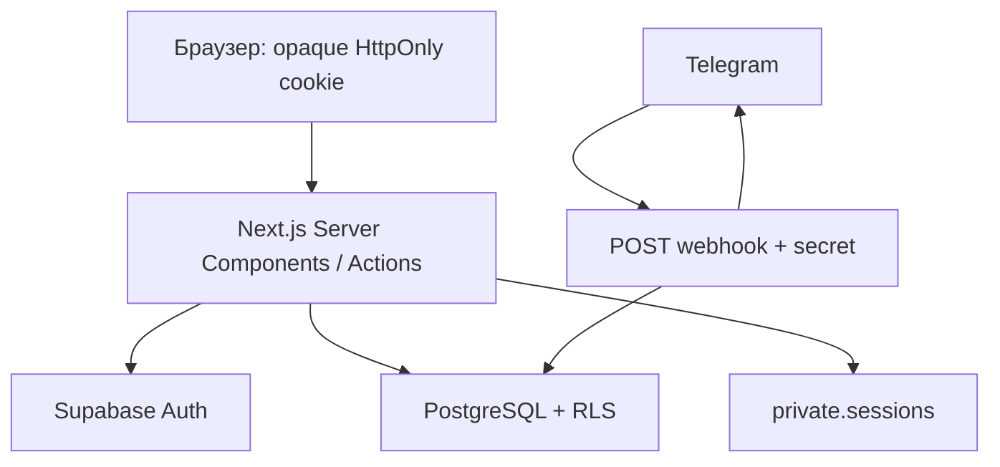

# Архитектура

## Уточнения 015

Редактор чата хранит структурированный AST, отображая его прямо в редактируемом DOM. Необработанный HTML не вставляется; серверная проверка структуры и безопасных URL сохранена. Файлы имеют общий бюджет 10 МБ на сообщение. Deferred DB trigger удаляет диалог при снятии последнего назначения пары, Storage очищается отдельно с persisted retry. Новые private bot RPC привязывают ответ к проверенному сообщению, общий сценарий бота сохраняет deep-link регистрацию.

## Пакет 014: актуальные изменения

Пакет 014 отменяет прежнее разрешение drag/transfer/time-edit для базового coral и edge-навигацию при drag. Дата, начало и длительность coral неизменны; нетемпоральный edit не запускает magnet. Проверки повторяются в командном RPC и триггере; старые подписанные снимки инвалидируются ротацией ключа при миграции. Recolor сохраняет интервал.

Начальная загрузка расписания: owner context + `schedule_week_snapshot` (2 RPC после проверки identity); диапазон ограничен неделей с interval overlap и нижней границей starts_at −600 минут, вытекающей из максимальной длительности. Имена возвращаются join-ами. Недели догружаются Server Action и хранятся в памяти Calendar. Мутации пока сохраняют прежний канонический full-owner ответ и подписанные снимки; это отдельная остаточная стоимость длинной истории.

Чат использует курсор revision, сериализованный строкой. Начальный snapshot — 200 последних сообщений; затем `chat_updates`, предыдущие сообщения — `chat_previous`. Версия каталога меняется при сообщениях, прочтении, назначениях и изменениях профиля. Навигация на странице чата получает unread через событие вместо второго polling.

Один Next.js App Router repository, Node 24, Vercel Functions. Server Components получают данные через feature queries/services. Интерактивные формы, мобильная навигация, Radix dialogs и Recharts работают на клиенте. Мутации — Server Actions с Zod и проверкой роли.

`src/proxy.ts` обновляет сессии и делает предварительный role redirect. `requireRole` на серверных страницах/actions повторно проверяет identity через `getUser`. Proxy не заменяет RLS. Защищённые layouts `force-dynamic`; пользовательские ответы не кешируются публично.

Три Supabase клиента: browser anonymous (`client.ts`), cookie SSR (`server.ts`), server-only service (`admin.ts`). SSR cookies адаптированы к серверному vault: браузер не получает технический email даже внутри JWT. Service key используется в узких операциях регистрации/бота/vault, а пользовательские чтения и admin UI writes — authenticated client под RLS.

Регистрация атомарна: `Admin API createUser` → `auth.users` trigger → consume token + profile + auth alias + application status в одной PostgreSQL транзакции. Для reset token claim и Auth API нельзя создать общую транзакцию: используется безопасное at-most-once погашение; при сбое запрашивается новая ссылка.

Статистика сохраняет интерфейс `StatisticsQuery → StatisticsResult` и читает проведённые `lessons` через authenticated Supabase под RLS. Длительность распределяется по локальным дням в сохранённом МСК-сдвиге зрителя; count относится к началу, заработок — к текущей глобальной ставке. Запросы выбирают пересечение интервалов и постранично читают все записи, включая продолжения с прошлой недели.

`features/schedule/page.tsx` — Server Component. `queries.ts` получает собственное расписание, безопасные имена и доступные варианты формы. Client Components в `components/schedule` реализуют сетку, Pointer Events, выделение, dialogs и меню. Каноническая неделя хранится в `?week=YYYY-MM-DD`; необязательный `day` сохраняет мобильный выбор. Native History API синхронизирован с Next Router; неделя и Back/Forward меняют только локальное отображение. Границы дней вычисляются явно: UTC+3 плюс пользовательский сдвиг, без timezone браузера.

Server Actions проверяют identity/роль и Zod, затем работают через authenticated client. Создание и редактирование используют owner-checked SECURITY DEFINER `save_schedule_lesson`: занятие и приватная заметка сохраняются одной транзакцией под RLS. Заметка загружается лениво через schedule_lesson_note с проверкой actor/owner для владельца и delegated admin. Student DTO не содержит заметок. Все пользовательские операции применяются оптимистически с блокировкой повторной отправки и откатом при ошибке. Exclusion constraints обеспечивают защиту от конкурирующих пересечений независимо от UI.

Слои: `app` — маршруты; `features` — actions, queries, services; `components` — интерфейс; `lib` — интеграции, security и validation; `supabase/migrations` — источник истины схемы.

## Канонические инварианты расписания

- SQL resolver проверяет полный интервал tutor + student, шаг 5 минут, поздний вариант при равенстве; старт в выбранном локальном дне до 23:55, окончание может перейти через полночь. Exclusion constraints и ограниченные retry защищают конкурирующие записи.
- Клиентский preview вызывает placeGroup по загруженным занятиям без перемещаемой группы, с учётом conflict class. Нет свободного положения группы — нет target/мутации, один toast после drop. Скрытые student-конфликты остаются исключительно серверными. UI принимает normalized result.lessons/rules/offset, при серверном сдвиге показывает информационный toast.
- Обычное создание/paste разрешено только в текущей неделе UTC+3+offset; dedicated transfer — в текущей или следующей реальной неделе; редактор ограничен семью днями недели занятия; drag в прошлое допустим, в будущую неделю — нет.
- Вся история читается пакетами по 500, имена — батчами. Навигация и CRUD не вызывают refresh/revalidatePath. Минутный polling updated_at с 10-минутным перекрытием работает отдельно и защищён lock + revision guard.
- Save/patch возвращают lesson без note; delete — фактически удалённые IDs. Owner-checked SECURITY DEFINER RPC атомарно сохраняют lesson+note. Прямые writes lessons/notes для authenticated отозваны; admin редактирует чужое расписание только через target-aware schedule_command.
- Hard delete предмета атомарно удаляет текущие связи, сохраняет lessons с nullable subject_id и subject_name_snapshot. Статистика и заметки не теряются.
- Cron каждые 5 минут копирует валидные занятия предыдущей локальной недели, не перемещая историю: новые IDs, completed_at=NULL, прежние цвет/длительность/заметка. Идемпотентность по (tutor_id,target_week_start); невалидные связи пропускаются, конфликт разрешается magnet либо безопасным skip.
- Schedule writers, hard-delete и rollover используют общий transaction advisory lock. При росте нагрузки измерять latency. Полная межвкладочная синхронизация удалений и восстановление цепочки пропущенных Cron-недель не входят в текущий пакет.

## Клиентские состояния

Календарь tutor/admin показывает saved/saving/error; у student индикатор и кнопки Undo/Redo скрыты. Все мутации, включая LessonDialog и offset, участвуют в общем статусе. Optimistic rollback оставляет error до успешной записи; локальная валидация формы до запроса статус не меняет.

DirectoryFilters оставляет получение/фильтрацию данных в PeoplePage (Server Component). Поиск откладывается на 300 мс; select применяет полный текущий draft сразу. useAutoFilters строит URL из синхронного ref, отменяет предыдущий timer, использует router.replace. Ответ собственного перехода не затирает более новый ввод; Back/Forward восстанавливают контролы. StatisticsView не remount-ится на каждый ответ: невалидная пара дат остаётся локальной, валидная применяется сразу; preset удаляет from/to.

Общие loading-кнопки и визуальные правила — [UI](ui-guidelines.md). Текущее [ТЗ](TZ_TutorGate_014_schedule_chat_bot_accounts_performance.md) и [фактические проверки](verification.md).

## Расписание 008

Общий Server Action scheduleCommandAction валидирует Zod и identity, затем вызывает owner-checked public.schedule_command. Move, delete, color, completed, transfer, availability, paste, create/edit, offset и restore выполняются одной транзакцией под общим advisory lock. Источники transfer остаются неактивными; targets имеют новый UUID, скопированную note, completed=false и отдельный transfer marker. Повторная команда переноса target запрещена; обычный drag разрешён в пределах общих правил.

Четыре partial GiST constraints отделяют active normal от active coral по tutor и student; inactive исключены. Серверный и клиентский magnet ищут один общий delta группы (шаг 5 минут, поздний вариант при равенстве), сохраняя относительные дни, время и длительности. Скрытые конфликты ученика остаются серверными.

Calendar применяет optimistic состояние до запроса, закрывает dialog после локальной валидации, блокирует повторные мутации и принимает canonical result.lessons/rules/offset. Ошибка возвращает предыдущие данные/выделение/offset, а create/edit — ещё и введённый draft. Saved/error не сбрасывается закрытием dialog.

Undo/redo живёт только в памяти смонтированного календаря. Сервер подписывает before/after снимки только затронутых строк, заметок, правил и offset; ключ хранится в закрытой private.schedule_signing_key. Restore проверяет подпись, владельца, область изменений и совпадение expected с текущими данными; сторонние изменения затронутых строк инвалидируют историю. Подпись нельзя получить через private RPC. Восстановление UUID, исторического предмета, заметок и статусов атомарно; exclusion constraints сохраняют силу. Незатронутые серверные строки не перезаписываются. Background sync не добавляется в историю.

Внутренний clipboard хранит выбранные source IDs и геометрию. Ctrl+C не записывает персональные данные в системный clipboard. Ctrl+V требует выбранной точки текущей недели, сервер копирует актуальные приватные заметки по owned source IDs. Rollover пропускает transferred sources, учитывает availability, очищает transfer metadata у recurring copies.

## Пакет 009: связанные удаления и модерация

`removeLessons` моделирует транзакционное удаление: target → восстановление source с повторным применением availability; source → очистка transfer metadata у target; обе стороны в одной команде → удаление обеих без восстановления. В БД это новая ветка `schedule_command`; область signed snapshot автоматически включает все изменённые строки, а не только входные ids. Конфликт при восстановлении source откатывает всю команду. Правила RLS, владения, constraint и magnet не ослаблены. Активное занятие отрисовывается выше coral и inactive; для разрешённых пересечений lanes не выделяются, на краю остаются узкие доступные области нижних слоёв, фокус поднимает карточку.

## Пакет 010

Admin user-actions используют отдельный server contract и транзакционные SQL RPC. Приватные login/Telegram ID присутствуют только в AdminDirectoryProfile; non-admin PeoplePage продолжает получать узкий Profile. Заблокированные accounts исключаются из новых selectors, удалённые отображаются tombstone-именем в истории. Серверный access layer, vault и RLS учитывают account status.

Telegram sync отделяет server-only Bot API/persistence от тестируемого batch orchestration; максимум пять параллельных getChat. Частичный успех сохраняется, stale update не перезаписывает удаление.

Calendar использует единый copy/paste pipeline для клавиатуры и context menu. Empty-grid menu вычисляет локальный день и 5-минутный snap общим gridAnchor, сохраняет UTC pasteAnchor; Create here передаёт draft в существующий LessonDialog. Clipboard хранится только в памяти. Буквенные shortcuts используют KeyboardEvent.code с Ctrl/Meta, игнорируют поля, contenteditable, combobox и dialogs. CRUD сохраняет optimistic flow, signed undo/redo и канонические server results.

Application tabs и period tabs используют общий CSS segmented pattern. Date/time cursor=text ограничен этими inputs и native indicators. Statistics controls имеют естественную высоту и обычный нижний margin.

`/admin/applications` — Server Component с серверными role/status-фильтрами и пагинацией по 50 строк. Мутации — Server Actions: getUser/requireRole(admin), только applicationId от клиента, далее service-only RPC с повторной проверкой admin и блокировкой заявки. DTO не содержит Telegram numeric identifiers или token hashes. Решение сохраняется до сетевого вызова Telegram; ошибка доставки не откатывает БД. Ссылки, TTL и аудит описаны в [auth-and-telegram](auth-and-telegram.md).

## Чат 011

Один диалог на student+tutor; предметы не создают дополнительные чаты. Active tutor/admin пишет в собственные чаты на /tutor/chats или /admin/chats. Student отвечает через Telegram. Polling 5 секунд в видимой вкладке, без overlap. Mark-read ограничен ID последнего полученного сообщения. Action проверяет requireRole([tutor, admin]), RPC повторно проверяет auth.uid и назначение. Service-only Telegram delivery после commit pending, safe DTO без Telegram IDs.

## Делегированное расписание 012

Вход из /admin/tutors ведёт на /admin/schedule?tutor=UUID; без query admin видит свой календарь. Server loader валидирует UUID и active teacher, повторная DB-проверка private.schedule_require_owner сопоставляет auth.uid() с owner. schedule_command(uuid,jsonb) передаёт owner явным аргументом во внутренний engine, без подмены JWT. schedule_owner_context читает offset/availability и выполняет rollover выбранного owner. Queries, polling, lesson notes и optimistic mutations используют тот же owner. Calendar key сбрасывает историю/clipboard/selection при смене владельца; History API сохраняет query tutor.

Delegated offset и restore с offsetChanged запрещены на сервере и в БД. Signed snapshots содержат owner; expected/target должны совпадать с выбранным owner. Прямые grants записи lessons/notes не расширены, tutor_id существующего занятия неизменен. Чаты admin остаются participant-based: назначения лично admin обязательны, доступа к чужим диалогам нет.

Bot handler разделяет control и send: собственные управляющие ответы идут через persistent control-message service, а уведомления преподавателю — через обычную доставку. Service-only adapter получает claim в БД и завершает его с актуальным message_id. Команды и текст пользователя создают новую панель; callback текущей панели редактирует сохранённый ID. Callback другого сообщения начинает новую панель, его ID не становится edit target. Заголовок расписания поддерживает action-slot общего PageHeading; возврат в справочник — навигационный Button asChild с иконкой ArrowLeft.

## Пакет 018: rich chat, ставки и персональный фон

[ТЗ 018](TZ_TutorGate_018_chat_schedule_rates_background.md) расширяет правила 014–017. Новые сообщения проходят единый parser v1/v2 и записываются как `{version:2,blocks}`; старые runs читаются без массовой перезаписи. Paragraph/alignment, quote, lists и code block сохраняются структурно. Plain body ограничен 4000 Unicode-символами. SQL независимо проверяет JSON и вычисляет body; album/reply/dedupe остаются атомарными. Telegram получает escaped HTML с закрытием сущностей при разбиении; LaTeX остаётся исходным текстом.

Редактор хранит локальную историю текста и форматирования. KaTeX загружается при формуле с `trust:false`, лимитами expansion/size и текстовым fallback. Code renderer с ограниченным набором grammar загружается только для code block; интерактивная кнопка копирования появляется после клиентской загрузки. Lottie light загружается только для TGS: gzip ограничен 2 МБ после распаковки, проверяются vector-only структура, глубина и число узлов; внешние assets и expressions запрещены. Media скачиваются с ограничением 10 МБ и проверкой сигнатуры; bucket остаётся private, превью ленивые. При reduced motion видео остановлено, GIF запускается явно.

Ставка проведённого занятия — `lessons.hourly_rate_snapshot`, приоритет pair → tutor → global. BEFORE trigger выполняется после activity triggers: completion фиксирует ставку, снятие очищает, несвязанные изменения сохраняют значение. Undo/redo восстанавливает ставку только из подписанного снимка; numeric сериализуется без лишнего scale для round-trip через JavaScript. Статистика суммирует duration × snapshot с прежним разбиением по локальным дням и без запроса текущей ставки. Ставки меняет только active admin; pair action передаёт проверенного owner и ID занятия, DB сама определяет student.

Фон расписания хранится отдельно от preferences, чтобы существующий UPDATE offset не открывал запись metadata. Server Actions проверяют self-owned tutor/admin, затем service-only staged RPC повторно проверяет actor=owner. Private bucket `schedule-backgrounds` ограничен 7 МБ и whitelist MIME; finalize проверяет размер и bytes. Новая metadata фиксируется атомарно, старый объект попадает в durable GC; сборка объектов и metadata заброшенных uploads происходит после истечения upload URLs (окно 3 часа), чтобы запоздалый PUT не оставлял orphan. Замена/удаление имеют optimistic preview с rollback и участвуют в SaveState. Delegated admin получает только чтение фона выбранного teacher. Signed URL действует час и обновляется через action каждые 45 минут; навигация по неделям не перевыпускает URL. Calendar background не входит в историю undo/redo занятий.
