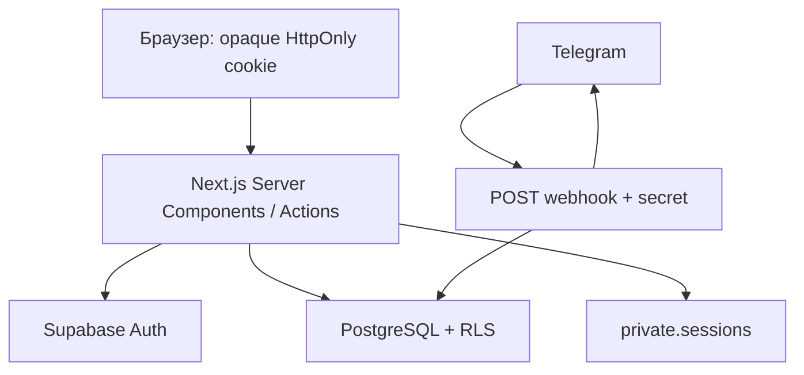

# Архитектура

Один Next.js App Router repository, Node 24, Vercel Functions. Server Components получают данные через feature queries/services. Интерактивные формы, мобильная навигация, Radix dialogs и Recharts работают на клиенте. Мутации — Server Actions с Zod и проверкой роли.

`src/proxy.ts` обновляет сессии и делает предварительный role redirect. `requireRole` на серверных страницах/actions повторно проверяет identity через `getUser`. Proxy не заменяет RLS. Защищённые layouts `force-dynamic`; пользовательские ответы не кешируются публично.

Три Supabase клиента: browser anonymous (`client.ts`), cookie SSR (`server.ts`), server-only service (`admin.ts`). SSR cookies адаптированы к серверному vault: браузер не получает технический email даже внутри JWT. Service key используется в узких операциях регистрации/бота/vault, а пользовательские чтения и admin UI writes — authenticated client под RLS.

Регистрация атомарна: `Admin API createUser` → `auth.users` trigger → consume token + profile + auth alias + application status в одной PostgreSQL транзакции. Для reset token claim и Auth API нельзя создать общую транзакцию: используется безопасное at-most-once погашение; при сбое запрашивается новая ссылка.

Статистика зависит от интерфейса `StatisticsQuery → StatisticsResult`. Реальный datasource появится после отдельного проектирования расписания. В MVP массив points пуст и totals равны нулю. Таблиц занятий нет.

Слои: `app` — маршруты; `features` — actions, queries, services; `components` — интерфейс; `lib` — интеграции, security и validation; `supabase/migrations` — источник истины схемы.
