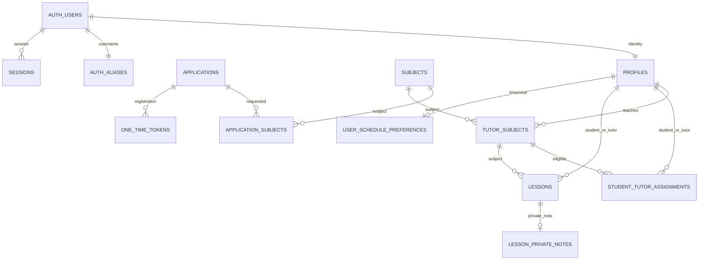

# База данных

Источник истины — SQL в `supabase/migrations`. Все public tables имеют RLS. `private` не экспонируется PostgREST. USAGE для authenticated нужен лишь для RLS helpers и не предоставляет SELECT на private tables.

## Таблицы и ограничения

| Таблица | Основные поля / ограничения |
|---|---|
| profiles | id → auth.users, role enum, full_name, Telegram username/user_id/chat_id; ID и chat уникальны, text; timestamps |
| applications | role student/tutor, ФИО, username, цель/опыт, privacy timestamp, status enum, verified/registered timestamps, реальные Telegram IDs после проверки |
| subjects | uuid, name, is_active, timestamps; уникальный lower(trim(name)) |
| application_subjects | composite PK(application_id,subject_id), FK |
| tutor_subjects | composite PK(tutor_id,subject_id), assigned_by, created_at |
| student_tutor_assignments | uuid, student_id,subject_id,tutor_id,assigned_by,timestamps; unique(student_id,subject_id); FK(tutor_id,subject_id) RESTRICT |
| app_settings | boolean singleton id=true; numeric(12,2) hourly_rate 0…1000000; updated_by/at |
| lessons | tutor/student/subject FK, starts_at/ends_at timestamptz, duration_minutes 1…600, color enum key, completed_at; tutor_subject FK RESTRICT; GiST exclusion для tutor и student |
| lesson_private_notes | lesson_id PK/FK CASCADE, note до 4000 символов, updated_at; пустая заметка хранится как пустая строка |
| user_schedule_preferences | user_id PK/FK CASCADE, msk_offset_hours −12…12, default 0; updated_at |
| private.auth_aliases | user_id PK, unique lowercase username, unique auth alias |
| private.one_time_tokens | uuid, purpose, SHA-256 hash unique, application_id/user_id, expiry, used_at, created_at |
| private.telegram_updates | update_id PK, application_id, hash, chat, delivered_at; хранится только hash регистрационной ссылки |
| private.sessions | SHA-256 handle PK, Supabase cookies JSONB, user_id, expiry, created_at; браузер не получает cookies JSONB |
| private.rate_limits | hashed key PK, count, expiry; распределённая защита Functions |

Индексы: profiles lower(full_name), Telegram username, assignments tutor_id, sessions expiry; unique/PK автоматически индексированы. `updated_at` обновляется триггерами.

## Доступ

| Entity | anon | student | tutor | admin |
|---|---|---|---|---|
| active subjects | read | read | read | read/write |
| inactive subjects | — | read | read | read |
| profiles basic columns | — | self + assigned tutors | self + assigned students | all |
| Telegram username | — | self via RPC | self via RPC | all via RPC |
| Telegram user/chat IDs | — | — | — | — |
| tutor_subjects | — | assigned pairs | own | all/write |
| assignments | — | own | own | all/write |
| settings | — | — | read | read/update |
| lessons | — | свои read | свои read/write | все read; свои write |
| lesson_private_notes | — | — | свои read/write | все read; свои write |
| user_schedule_preferences | — | свои read/insert/update | свои read/insert/update | свои read/insert/update |
| applications/private tables | — | — | — | — |

`visible_profiles` — security definer RPC с явной проверкой связей; скрывает Telegram username от peers. Прямое чтение profiles ограничено column grants. `set_tutor_subjects` доступна authenticated, но внутри обязательно `is_admin`; операция транзакционная. `save_schedule_lesson` — authenticated SECURITY INVOKER, проверяет роль и сохраняет lesson+note под RLS атомарно. `schedule_lesson_names` — узкий SECURITY DEFINER для безопасных имён участников доступных занятий, в том числе после смены назначений; не расширяет права на profiles/Telegram. Служебные RPC регистрации, токенов, сессий и Telegram исполняет только service_role.

`validate_lesson` запрещает подмену tutor_id, проверяет роль ученика и назначение пары, активность предмета при создании/смене. FK гарантирует доступность предмета репетитору. Триггер всегда пересчитывает ends_at. Неактивный исторический предмет сохраняется; для изменения занятия ученик должен оставаться назначен этому репетитору. Индексы `(tutor_id,starts_at,ends_at)`, `(student_id,starts_at,ends_at)` и partial completed index поддерживают выборки. `btree_gist` и полуоткрытые диапазоны `[)` разрешают back-to-back и запрещают конкурентные пересечения. `delete_schedule_lessons` — authenticated SECURITY INVOKER: удаление собственных UUID одним SQL statement; массив передаётся POST body, чтобы массовое выделение не упиралось в длину URL.

Триггеры запрещают невалидные роли и неактивные предметы в новых назначениях. Снятие tutor_subject при наличии assignments блокирует FK. Deactivate subject сохраняет исторические связи.

## История

- 001: полная начальная схема, RLS, service RPC, atomic registration.
- 002: шесть начальных активных предметов; администратор меняет каталог.
- 003: привязка vault session к user и отзыв после password reset.
- 004: освобождение Telegram reservation просроченной незавершённой заявки при новой заявке.
- 005: расписание, GiST overlap constraints, notes/preferences RLS, authenticated schedule RPC и tutor чтение ставки.

Просроченные vault sessions и rate buckets удаляются при соответствующих операциях. История заявок/токенов остаётся; политика длительного хранения персональных данных определяется владельцем перед эксплуатацией.
