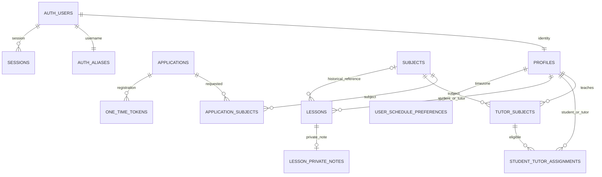

# База данных

Источник истины — SQL в `supabase/migrations`. Все public tables имеют RLS. `private` не экспонируется PostgREST. USAGE для authenticated нужен лишь для RLS helpers и не предоставляет SELECT на private tables.

## Таблицы и ограничения

| Таблица | Основные поля / ограничения |
|---|---|
| profiles | id → auth.users, role enum, full_name, Telegram username/user_id/chat_id; ID и chat уникальны, text; timestamps |
| applications | role student/tutor, ФИО, username, цель/опыт, privacy timestamp, status enum, verified/registered timestamps, реальные Telegram IDs после проверки |
| subjects | uuid, name, is_active, timestamps; уникальный lower(trim(name)) |
| application_subjects | composite PK(application_id,subject_id), FK |
| tutor_subjects | composite PK(tutor_id,subject_id), assigned_by, created_at |
| student_tutor_assignments | uuid, student_id,subject_id,tutor_id,assigned_by,timestamps; unique(student_id,subject_id); FK(tutor_id,subject_id) RESTRICT |
| app_settings | boolean singleton id=true; numeric(12,2) hourly_rate 0…1000000; updated_by/at |
| lessons | tutor/student FK; subject_id nullable SET NULL + subject_name_snapshot, starts_at/ends_at timestamptz, duration_minutes 1…600, color enum key, completed_at; без составного FK на tutor_subjects; GiST exclusion для tutor и student |
| lesson_private_notes | lesson_id PK/FK CASCADE, note до 4000 символов, updated_at; пустая заметка хранится как пустая строка |
| user_schedule_preferences | user_id PK/FK CASCADE, msk_offset_hours −12…12, default 0; updated_at |
| private.auth_aliases | user_id PK, unique lowercase username, unique auth alias |
| private.one_time_tokens | uuid, purpose, SHA-256 hash unique, application_id/user_id, expiry, used_at, created_at |
| private.telegram_updates | update_id PK, application_id, hash, chat, delivered_at; для новых подтверждений хранится hash Telegram deep link, не регистрационной ссылки |
| private.sessions | SHA-256 handle PK, Supabase cookies JSONB, user_id, expiry, created_at; браузер не получает cookies JSONB |
| private.rate_limits | hashed key PK, count, expiry; распределённая защита Functions |

Индексы: profiles lower(full_name), Telegram username, assignments tutor_id, sessions expiry; unique/PK автоматически индексированы. `updated_at` обновляется триггерами.

## Доступ

| Entity | anon | student | tutor | admin |
|---|---|---|---|---|
| active subjects | read | read | read | read/write |
| inactive subjects | — | read | read | read |
| profiles basic columns | — | self + assigned tutors | self + assigned students | all |
| Telegram username | — | self via RPC | self via RPC | all via RPC |
| Telegram user/chat IDs | — | — | — | — |
| tutor_subjects | — | assigned pairs | own | all/write |
| assignments | — | own | own | all/write |
| settings | — | — | read | read/update |
| lessons | — | свои read | свои read/write | все read; свои write |
| lesson_private_notes | — | — | свои read/write | свои read/write через RPC |
| user_schedule_preferences | — | свои read/insert/update | свои read/insert/update | свои read/insert/update |
| applications/private tables | — | — | — | — |

`visible_profiles` остаётся узким интерфейсом безопасных имён. Приватные функции авторизации и Telegram не изменены. Обычное снятие tutor_subjects при student assignments по-прежнему запрещено FK RESTRICT; полное удаление subject — отдельная атомарная admin RPC.

В 006 добавлены индексы (tutor_id,updated_at,id), (student_id,updated_at,id) и таблица schedule_week_rollovers с PK(tutor_id,target_week_start), copied_count, skipped_count, results, completed_at. Журнал доступен только владельцу. Time indexes сохранены; в 007 общие GiST exclusions заменены четырьмя partial constraints по conflict class.

Канонические правила расписания: [архитектура](architecture.md).

## История

- 001: полная начальная схема, RLS, service RPC, atomic registration.
- 002: шесть начальных активных предметов; администратор меняет каталог.
- 003: привязка vault session к user и отзыв после password reset.
- 004: освобождение Telegram reservation просроченной незавершённой заявки при новой заявке.
- 006: hard-delete/snapshots, atomic magnet RPC, rollover и Cron.
- 005: расписание, GiST overlap constraints, notes/preferences RLS, authenticated schedule RPC и tutor чтение ставки.

Просроченные vault sessions и rate buckets удаляются при соответствующих операциях. История заявок/токенов остаётся; политика длительного хранения персональных данных определяется владельцем перед эксплуатацией.

## Миграция 007 / пакет ТЗ 008

lessons: inactive_reason (transferred / available_from / NULL), inactive_until (date), is_transfer_target, transfer_source_id и transfer_source_starts_at. Связь переноса хранится как snapshot без каскадного удаления marker при удалении source. Триггер lesson_activity вычисляет availability по локальной дате старта и сбрасывает completed_at у inactive. Transferred имеет приоритет над availability.

tutor_student_availability: PK(tutor_id, student_id), available_from; RLS SELECT только своему tutor/admin, прямые authenticated writes отозваны. schedule_command управляет правилами и занятиями атомарно. Отмена правила с конфликтом реактивации полностью откатывается.

lessons_tutor_normal_overlap, lessons_student_normal_overlap, lessons_tutor_coral_overlap, lessons_student_coral_overlap — DEFERRABLE partial GiST exclusions. Normal означает любой активный цвет кроме coral. Constraints откладываются только внутри группового размещения и проверяются до возврата результата; concurrent writes не обходят защиту.

public.schedule_command(jsonb) — authenticated RPC с обязательным auth.uid()/role/ownership, подписанными before/after, canonical lessons/rules/offset. Student допускается только к личному offset/его restore. Старые single RPC сохраняют owner-checks, новый resolver и запрет изменения inactive. restore не принимает произвольные записи: подпись закрытым ключом, одинаковая область expected/target, compare-and-swap затронутых данных, защищённый контекст для восстановления исторических assignments, затем FK и exclusion checks.

private.schedule_signing_key содержит один случайный ключ, а не историю операций. private.sign_schedule, scope_schedule, schedule_snapshot и signed_schedule_snapshot не доступны API-ролям. Снимки с note возвращаются только владельцу в ответе мутации; student DTO и polling не содержат note. Серверная история в таблицах не хранится.

## Повторное применение после deadlock

Если полное применение 007 было отменено с 40P01, подготовить SQL для повторного запуска командой `node scripts/prepare-schedule-migration.mjs`. Полученный `artifacts/apply-schedule-features.sql` запускается целиком в SQL Editor от владельца БД, в короткое окно без активности приложения. Он содержит неизменное тело 007 внутри одной транзакции: сначала pg_try_advisory_xact_lock(842106001), затем ACCESS EXCLUSIVE NOWAIT для существующих таблиц расписания и связанных справочников, затем DDL. Обычные чтения также учитываются, хотя не берут advisory lock.

При занятом writer lock или таблице возвращается 55P03 до DDL; повторять весь файл после завершения активных запросов. Успешно применённую 007 повторять нельзя; guard обнаруживает уже существующий inactive_reason. Если исходный файл запускали фрагментами, сначала выяснить фактическое состояние схемы. Если SQL Editor сообщает 25P02 (transaction is aborted), завершить именно неудавшуюся транзакцию ROLLBACK и повторить полный файл. Процессы и Cron скрипт не завершает и не отключает. Во время успешного применения блокируются обращения к перечисленным таблицам до COMMIT.

## Миграции 008/009: заявки и переносы

- 008: отдельный commit новых enum `pending_review`, `approved`, `rejected`.
- 009: review audit (`reviewed_at/by`, snapshot имени, `approved_at`, `rejected_at`), delivery status/time; безопасная миграция старых verified-заявок в очередь.
- Частичная уникальность applications по Telegram user/chat ID для статусов кроме rejected/expired. У profiles полная уникальность не меняется. История не стирается ради повторной подачи.
- Private notification ledger с уникальностью application/admin; обычным authenticated недоступен.
- `confirm_telegram(bigint,text,text,text,text)` не принимает registration hash и не выдаёт ссылку регистрации.
- `admin_applications`, `review_application`, `application_link_delivered` — только service_role; actor обязан быть admin в БД. Queue DTO исключает numeric Telegram IDs/token hashes. Прямой SELECT applications для authenticated не открывался.
- `register_auth_user` и `token_status` допускают регистрацию только approved+verified+valid token; atomic auth/profile creation сохранена.
- Expiration trigger истекает только pending_telegram; approved сохраняется для resend.
- `schedule_command` заменён целиком в новой миграции, без изменения прежних файлов. Delete target восстанавливает source через lesson_activity, delete source очищает metadata оставшегося target. Batch пропускает удаляемые записи; snapshot scopes включают связанные изменения. Constraint conflict откатывает всю команду.

Сроки и ограничения Telegram описаны в [авторизации](auth-and-telegram.md). Новые миграции включены в PGlite suites; фактический результат их запуска указан в [verification](verification.md).
