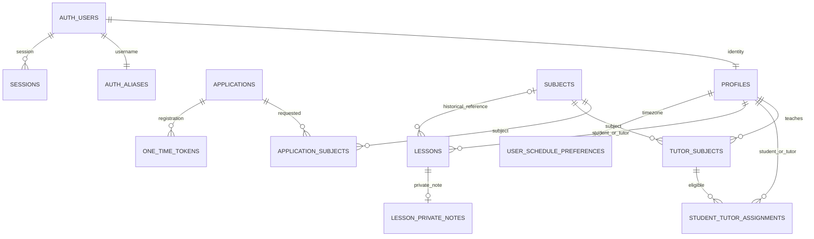

# База данных

Источник истины — SQL в `supabase/migrations`. Все public tables имеют RLS. `private` не экспонируется PostgREST. USAGE для authenticated нужен лишь для RLS helpers и не предоставляет SELECT на private tables.

## Таблицы и ограничения

| Таблица | Основные поля / ограничения |
|---|---|
| profiles | id → auth.users, role enum, full_name, Telegram username/user_id/chat_id; ID и chat уникальны, text; timestamps |
| applications | role student/tutor, ФИО, username, цель/опыт, privacy timestamp, status enum, verified/registered timestamps, реальные Telegram IDs после проверки |
| subjects | uuid, name, is_active, timestamps; уникальный lower(trim(name)) |
| application_subjects | composite PK(application_id,subject_id), FK |
| tutor_subjects | composite PK(tutor_id,subject_id), assigned_by, created_at |
| student_tutor_assignments | uuid, student_id,subject_id,tutor_id,assigned_by,timestamps; unique(student_id,subject_id); FK(tutor_id,subject_id) RESTRICT |
| app_settings | boolean singleton id=true; numeric(12,2) hourly_rate 0…1000000; updated_by/at |
| lessons | tutor/student FK; subject_id nullable SET NULL + subject_name_snapshot, starts_at/ends_at timestamptz, duration_minutes 1…600, color enum key, completed_at; без составного FK на tutor_subjects; GiST exclusion для tutor и student |
| lesson_private_notes | lesson_id PK/FK CASCADE, note до 4000 символов, updated_at; пустая заметка хранится как пустая строка |
| user_schedule_preferences | user_id PK/FK CASCADE, msk_offset_hours −12…12, default 0; updated_at |
| private.auth_aliases | user_id PK, unique lowercase username, unique auth alias |
| private.one_time_tokens | uuid, purpose, SHA-256 hash unique, application_id/user_id, expiry, used_at, created_at |
| private.telegram_updates | update_id PK, application_id, hash, chat, delivered_at; хранится только hash регистрационной ссылки |
| private.sessions | SHA-256 handle PK, Supabase cookies JSONB, user_id, expiry, created_at; браузер не получает cookies JSONB |
| private.rate_limits | hashed key PK, count, expiry; распределённая защита Functions |

Индексы: profiles lower(full_name), Telegram username, assignments tutor_id, sessions expiry; unique/PK автоматически индексированы. `updated_at` обновляется триггерами.

## Доступ

| Entity | anon | student | tutor | admin |
|---|---|---|---|---|
| active subjects | read | read | read | read/write |
| inactive subjects | — | read | read | read |
| profiles basic columns | — | self + assigned tutors | self + assigned students | all |
| Telegram username | — | self via RPC | self via RPC | all via RPC |
| Telegram user/chat IDs | — | — | — | — |
| tutor_subjects | — | assigned pairs | own | all/write |
| assignments | — | own | own | all/write |
| settings | — | — | read | read/update |
| lessons | — | свои read | свои read/write | все read; свои write |
| lesson_private_notes | — | — | свои read/write | свои read/write через RPC |
| user_schedule_preferences | — | свои read/insert/update | свои read/insert/update | свои read/insert/update |
| applications/private tables | — | — | — | — |

`visible_profiles` остаётся узким интерфейсом безопасных имён. Приватные функции авторизации и Telegram не изменены. Обычное снятие tutor_subjects при student assignments по-прежнему запрещено FK RESTRICT; полное удаление subject — отдельная атомарная admin RPC.

В 006 добавлены индексы (tutor_id,updated_at,id), (student_id,updated_at,id) и таблица schedule_week_rollovers с PK(tutor_id,target_week_start), copied_count, skipped_count, results, completed_at. Журнал доступен только владельцу. Time indexes и оба GiST exclusions сохранены.

## Актуальные правила schedule upgrade 006
- Предмет удаляется физически через admin RPC delete_subject_hard: assignments → tutor_subjects → application_subjects → subjects, атомарно. Lessons остаются с nullable subject_id ON DELETE SET NULL и subject_name_snapshot. Пока предмет существует, отображается текущее имя; после удаления — исторический snapshot. Статистика и заметки сохраняются.
- Вся история календаря загружается при открытии пакетами по 500; имена также батчами. Неделя/день — локальное состояние + History API. Навигация и CRUD не вызывают router.refresh или revalidatePath. Force-dynamic статистика читает актуальные данные при заходе.
- Save/patch возвращают нормализованный lesson без note, delete — фактически удалённые IDs. Заметки загружаются отдельно только владельцу. Общие сообщения — единый Toaster, ошибки полей остаются inline.
- Один private SQL magnet resolver: ближайший полный свободный интервал tutor+student, шаг 5 мин, при равенстве расстояний — позже. Start остаётся в выбранном дне (последний старт 23:55), окончание может выйти за полночь. Exclusion constraints сохранены; ограниченные retry защищают от гонок.
- Ручное создание — только текущая локальная неделя (UTC+3+сохранённый offset). Диалог редактирования ограничен семью днями недели карточки; drag может идти в прошлое, но не в будущую неделю. Все ограничения повторяются на сервере.
- Owner-checked SECURITY DEFINER RPC сохраняют lesson+note атомарно. Прямые INSERT/UPDATE/DELETE lessons/notes для authenticated отозваны. Роль admin не даёт права писать в чужой календарь. Private helpers не доступны anon/authenticated, private schema не экспонируется.
- Cron каждые 5 минут копирует валидные занятия предыдущей локальной недели. Новые IDs, completed_at=NULL, прежние цвет/длительность/заметка. История не перемещается. Idempotency: (tutor_id,target_week_start). Удалённые предметы и снятые назначения не копируются; конфликт использует magnet или записывается как безопасный skip.
- Все schedule writers, hard-delete и rollover сериализованы одним transaction advisory lock. Это консервативная стратегия для конфликтов общего student; при высокой нагрузке нужно измерять latency и длительность Cron.
- Видимый календарь раз в минуту читает только обновлённые строки по updated_at cursor с 10-минутным перекрытием. Это независимый от навигации инкремент для автокопий репетиторов с разными offset, а не повторный all-history preload. In-flight polling не перезаписывает мутации: lock + revision guard. Полная межвкладочная realtime-синхронизация удалений не входит в релиз.
- UI: Select/Combobox с portal и поиском, Tooltip, Toaster; native selects убраны. Numeric spinners скрыты, min/max/step сохранены. Заметка 88–240px с auto-grow и внутренней прокруткой. Completed — зелёный Lucide CircleCheck. Undo/Redo только disabled icons.

Фактическая проверка этой ревизии: docs/verification.md (для файлов в docs — verification.md). Старые результаты CI не подтверждают новую ревизию.

## История

- 001: полная начальная схема, RLS, service RPC, atomic registration.
- 002: шесть начальных активных предметов; администратор меняет каталог.
- 003: привязка vault session к user и отзыв после password reset.
- 004: освобождение Telegram reservation просроченной незавершённой заявки при новой заявке.
- 006: hard-delete/snapshots, atomic magnet RPC, rollover и Cron.
- 005: расписание, GiST overlap constraints, notes/preferences RLS, authenticated schedule RPC и tutor чтение ставки.

Просроченные vault sessions и rate buckets удаляются при соответствующих операциях. История заявок/токенов остаётся; политика длительного хранения персональных данных определяется владельцем перед эксплуатацией.
