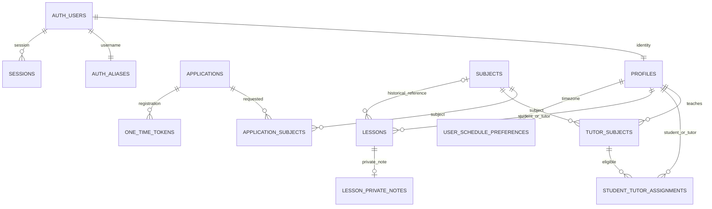

# База данных

## Миграция 017

`202609080017_telegram_sync_albums.sql` применяется после 016. `deleting_profile_locked` выполняется как SECURITY DEFINER с закрытым search_path: чтение private deletion ledger больше не отклоняет обычное service-role обновление Telegram username, а запрет восстановления удаляемого пользователя сохраняется.

`private.telegram_albums` закрепляет student/tutor, reply и исходный prompt для `media_group_id`. Service-only target/receive RPC повторно проверяют активную пару; блокировка профиля/альбома сериализует добавление файлов. Telegram update ID дедуплицируется, все вложения группы получают общий message ID и лимиты 10 файлов/10 МБ. Изменение сообщения обновляет revision. Контекст сохраняется после сброса recipient, не переносится на другую группу и удаляется при снятии последнего назначения либо удалении сообщения/профиля. Контекст старше 24 часов не принимает новые части.

## Миграция 016

`202609080016_application_search.sql` применяется после 015. Service-only `admin_applications_search` проверяет активного администратора, ищет по имени и Telegram username без учёта регистра, убирает начальный `@`, фильтрует до подсчёта и пагинации по 50 записей. Символы `%` и `_` ищутся буквально. Старый RPC сохранён для исторических клиентов.

`bot_directory_contact` повторно проверяет Telegram user ID, private chat ID и роль активного администратора; возвращает профиль только в доверенный webhook. Ссылка с сайта содержит UUID профиля, а не Telegram peer. Чужие роли не могут получить контакт через deep link.

## Миграция 015

`chat_attachment_budget` защищает суммарный размер вложений одного сообщения (10 МБ) даже для service writes. Deferred trigger `chat_purge_unassigned_pair` очищает conversation/messages/attachments/upload reservations и recipient state после снятия последнего назначения student–tutor; сохранение другого предмета с тем же teacher сохраняет чат. Удаление и повторная вставка назначения в одной транзакции не стирают действующий диалог.

Storage очищается через API после успешного admin action. `chat_storage_gc.revoked` хранит задания для повторного удаления при сбое; `cleanup-chat-storage.mjs` сначала повторяет немедленную очистку, а после защитного срока убирает объекты ещё раз на случай действовавшего signed upload URL. Строки GC не дают доступа к файлам. Смена или исчезновение conversation ID сбрасывает клиентский кэш истории.

`private.telegram_reply_state` хранит только проверенную привязку ответа ученика к сообщению преподавателя. `chat_bot_begin_reply` проверяет identity, назначение, chat ID и mapping исходного Telegram message ID. `chat_bot_receive_flow` атомарно сохраняет входящий текст/файл и возвращает доверенный контекст квитанции; после успешного приёма очищает выбранного адресата и reply state. Все новые bot/storage RPC доступны только service_role, private state закрыт от API-ролей.

## Пакет 014: текущие контракты

Миграция `202609070014_product_polish_chat_files_hard_delete_performance.sql` применяется после 013. Исторические миграции сохранены.

`chat_messages.content` — whitelist JSON runs (text + marks), body — plain preview. Старые сообщения получают plain runs. `chat_attachments` хранит metadata; размер 1…10485760. Deferred trigger требует непустой текст либо вложение. Публичное чтение storage_path не разрешено, DTO содержит только безопасные метаданные. Participant RLS сохраняется без общего admin bypass. Signed download URL выдаёт Server Action после проверки активной пары, TTL 60 секунд. `private.chat_uploads` резервирует пути; service-only finalize проверяет пару повторно, сервер сверяет фактический размер Storage. HTML/SVG выдаются как download, не inline image.

Hard delete заменяет конечный soft-delete 010: prepare блокирует вход и отзывает сессии, private ledger сохраняет пути; сервер удаляет Storage, DB purge удаляет зависимости/profile, Auth Admin API физически удаляет UUID. Finish проверяет отсутствие Auth/profile. Только active admin, admin/self targets запрещены. Audit FK nullable SET NULL. Старый authenticated soft-delete endpoint закрыт. Незавершённые удаления доступны для повтора в каталоге администратора.

Чтобы старое разрешение upload не восстановило объект после удаления, job с недавними вложениями/загрузками ожидает истечения signed upload URL (до 2 часов 5 минут). До завершения пользователю закрыт доступ; UI не сообщает успех. Для прямого удаления сообщений/conversations metadata cascade ставит объект в private GC ledger. Развёртывание требует часового запуска `node --env-file=.env.local scripts/cleanup-chat-storage.mjs` доверенным scheduler; script идемпотентен, signed paths не переиспользуются.

Optimized reads: `schedule_week_snapshot`, `chat_updates`, `chat_previous`, `admin_directory_page` (50 строк). Технические bot/media/deletion/GC RPC доступны только service_role, actor повторно проверяется в DB. Индекс `chat_messages(conversation_id,revision)` добавлен после fixture EXPLAIN с полным сканированием 10 000 строк. Для statistics существующий `lessons_tutor_time` используется; дополнительные индексы статистики/assignments без подтверждения не добавлены.

Источник истины — SQL в `supabase/migrations`. Все public tables имеют RLS. `private` не экспонируется PostgREST. USAGE для authenticated нужен лишь для RLS helpers и не предоставляет SELECT на private tables.

## Таблицы и ограничения

| Таблица | Основные поля / ограничения |
|---|---|
| profiles | id → auth.users, role enum, full_name, Telegram username/user_id/chat_id; ID и chat уникальны, text; timestamps |
| applications | role student/tutor, ФИО, username, цель/опыт, privacy timestamp, status enum, verified/registered timestamps, реальные Telegram IDs после проверки |
| subjects | uuid, name, is_active, timestamps; уникальный lower(trim(name)) |
| application_subjects | composite PK(application_id,subject_id), FK |
| tutor_subjects | composite PK(tutor_id,subject_id), assigned_by, created_at |
| student_tutor_assignments | uuid, student_id,subject_id,tutor_id,assigned_by,timestamps; unique(student_id,subject_id); FK(tutor_id,subject_id) RESTRICT |
| app_settings | boolean singleton id=true; numeric(12,2) hourly_rate 0…1000000; updated_by/at |
| lessons | tutor/student FK; subject_id nullable SET NULL + subject_name_snapshot, starts_at/ends_at timestamptz, duration_minutes 1…600, color enum key, completed_at; без составного FK на tutor_subjects; GiST exclusion для tutor и student |
| lesson_private_notes | lesson_id PK/FK CASCADE, note до 4000 символов, updated_at; пустая заметка хранится как пустая строка |
| user_schedule_preferences | user_id PK/FK CASCADE, msk_offset_hours −12…12, default 0; updated_at |
| private.auth_aliases | user_id PK, unique lowercase username, unique auth alias |
| private.one_time_tokens | uuid, purpose, SHA-256 hash unique, application_id/user_id, expiry, used_at, created_at |
| private.telegram_updates | update_id PK, application_id, hash, chat, delivered_at; для новых подтверждений хранится hash Telegram deep link, не регистрационной ссылки |
| private.sessions | SHA-256 handle PK, Supabase cookies JSONB, user_id, expiry, created_at; браузер не получает cookies JSONB |
| private.rate_limits | hashed key PK, count, expiry; распределённая защита Functions |

Индексы: profiles lower(full_name), Telegram username, assignments tutor_id, sessions expiry; unique/PK автоматически индексированы. `updated_at` обновляется триггерами.

## Доступ

| Entity | anon | student | tutor | admin |
|---|---|---|---|---|
| active subjects | read | read | read | read/write |
| inactive subjects | — | read | read | read |
| profiles basic columns | — | self + assigned tutors | self + assigned students | all |
| Telegram username | — | self via RPC | self via RPC | all via RPC |
| Telegram user ID | — | — | — | admin_directory_profiles only |
| Telegram chat ID | — | — | — | — |
| tutor_subjects | — | assigned pairs | own | all/write |
| assignments | — | own | own | all/write |
| settings | — | — | read | read/update |
| lessons | — | свои read | свои read; write через RPC | все read; write через проверенный owner RPC |
| lesson_private_notes | — | — | свои read; write через RPC | свои и delegated read/write через owner RPC |
| user_schedule_preferences | — | свои read/insert/update | свои read/insert/update | свои read/insert/update |
| applications/private tables | — | — | — | — |

`visible_profiles` остаётся узким интерфейсом безопасных имён. Приватные функции авторизации и Telegram не изменены. Обычное снятие tutor_subjects при student assignments по-прежнему запрещено FK RESTRICT; полное удаление subject — отдельная атомарная admin RPC.

В 006 добавлены индексы (tutor_id,updated_at,id), (student_id,updated_at,id) и таблица schedule_week_rollovers с PK(tutor_id,target_week_start), copied_count, skipped_count, results, completed_at. Журнал доступен только владельцу. Time indexes сохранены; в 007 общие GiST exclusions заменены четырьмя partial constraints по conflict class.

Канонические правила расписания: [архитектура](architecture.md).

## История

- 001: полная начальная схема, RLS, service RPC, atomic registration.
- 002: шесть начальных активных предметов; администратор меняет каталог.
- 003: привязка vault session к user и отзыв после password reset.
- 004: освобождение Telegram reservation просроченной незавершённой заявки при новой заявке.
- 006: hard-delete/snapshots, atomic magnet RPC, rollover и Cron.
- 005: расписание, GiST overlap constraints, notes/preferences RLS, authenticated schedule RPC и tutor чтение ставки.

Просроченные vault sessions и rate buckets удаляются при соответствующих операциях. История заявок/токенов остаётся; политика длительного хранения персональных данных определяется владельцем перед эксплуатацией.

## Миграция 007 / пакет ТЗ 008

lessons: inactive_reason (transferred / available_from / NULL), inactive_until (date), is_transfer_target, transfer_source_id и transfer_source_starts_at. Связь переноса хранится как snapshot без каскадного удаления marker при удалении source. Триггер lesson_activity вычисляет availability по локальной дате старта и сбрасывает completed_at у inactive. Transferred имеет приоритет над availability.

tutor_student_availability: PK(tutor_id, student_id), available_from; RLS SELECT только своему tutor/admin, прямые authenticated writes отозваны. schedule_command управляет правилами и занятиями атомарно. Отмена правила с конфликтом реактивации полностью откатывается.

lessons_tutor_normal_overlap, lessons_student_normal_overlap, lessons_tutor_coral_overlap, lessons_student_coral_overlap — DEFERRABLE partial GiST exclusions. Normal означает любой активный цвет кроме coral. Constraints откладываются только внутри группового размещения и проверяются до возврата результата; concurrent writes не обходят защиту.

public.schedule_command(jsonb) — authenticated RPC с обязательным auth.uid()/role/ownership, подписанными before/after, canonical lessons/rules/offset. Student допускается только к личному offset/его restore. Старые single RPC сохраняют owner-checks, новый resolver и запрет изменения inactive. restore не принимает произвольные записи: подпись закрытым ключом, одинаковая область expected/target, compare-and-swap затронутых данных, защищённый контекст для восстановления исторических assignments, затем FK и exclusion checks.

private.schedule_signing_key содержит один случайный ключ, а не историю операций. private.sign_schedule, scope_schedule, schedule_snapshot и signed_schedule_snapshot не доступны API-ролям. Снимки с note возвращаются владельцу и авторизованному delegated admin в ответе мутации; student DTO и polling не содержат note. Серверная история в таблицах не хранится.

## Повторное применение после deadlock

Если полное применение 007 было отменено с 40P01, подготовить SQL для повторного запуска командой `node scripts/prepare-schedule-migration.mjs`. Полученный `artifacts/apply-schedule-features.sql` запускается целиком в SQL Editor от владельца БД, в короткое окно без активности приложения. Он содержит неизменное тело 007 внутри одной транзакции: сначала pg_try_advisory_xact_lock(842106001), затем ACCESS EXCLUSIVE NOWAIT для существующих таблиц расписания и связанных справочников, затем DDL. Обычные чтения также учитываются, хотя не берут advisory lock.

При занятом writer lock или таблице возвращается 55P03 до DDL; повторять весь файл после завершения активных запросов. Успешно применённую 007 повторять нельзя; guard обнаруживает уже существующий inactive_reason. Если исходный файл запускали фрагментами, сначала выяснить фактическое состояние схемы. Если SQL Editor сообщает 25P02 (transaction is aborted), завершить именно неудавшуюся транзакцию ROLLBACK и повторить полный файл. Процессы и Cron скрипт не завершает и не отключает. Во время успешного применения блокируются обращения к перечисленным таблицам до COMMIT.

## Миграции 008/009: заявки и переносы

- 008: отдельный commit новых enum `pending_review`, `approved`, `rejected`.
- 009: review audit (`reviewed_at/by`, snapshot имени, `approved_at`, `rejected_at`), delivery status/time; безопасная миграция старых verified-заявок в очередь.
- Частичная уникальность applications по Telegram user/chat ID для статусов кроме rejected/expired. У profiles полная уникальность не меняется. История не стирается ради повторной подачи.
- Private notification ledger с уникальностью application/admin; обычным authenticated недоступен.
- `confirm_telegram(bigint,text,text,text,text)` не принимает registration hash и не выдаёт ссылку регистрации.
- `admin_applications`, `review_application`, `application_link_delivered` — только service_role; actor обязан быть admin в БД. Queue DTO исключает numeric Telegram IDs/token hashes. Прямой SELECT applications для authenticated не открывался.
- `register_auth_user` и `token_status` допускают регистрацию только approved+verified+valid token; atomic auth/profile creation сохранена.
- Expiration trigger истекает только pending_telegram; approved сохраняется для resend.
- `schedule_command` заменён целиком в новой миграции, без изменения прежних файлов. Delete target восстанавливает source через lesson_activity, delete source очищает metadata оставшегося target. Batch пропускает удаляемые записи; snapshot scopes включают связанные изменения. Constraint conflict откатывает всю команду.

Сроки и ограничения Telegram описаны в [авторизации](auth-and-telegram.md). Новые миграции включены в PGlite suites; фактический результат их запуска указан в [verification](verification.md).

## Миграция 010: состояния аккаунтов

`profiles.account_status`: active / blocked / deleted, default active; blocked_at/by и deleted_at/by хранят аудит. Telegram username nullable; постоянные user/chat IDs nullable только у deleted (CHECK), уникальность сохраняется. На profiles нет новых authenticated UPDATE grants.

`admin_directory_profiles()` — authenticated SECURITY DEFINER с проверкой private.is_admin; возвращает safe profile + login из private.auth_aliases, Telegram user ID, status, blocked_at. Chat ID не возвращается. Deleted скрыты; blocked остаются. Обычный `visible_profiles()` сохраняет прежний узкий DTO и возвращает только active accounts активному viewer. Имена в истории по-прежнему читаются через schedule_lesson_names с owner checks, включая tombstone-профили.

`admin_change_user_role(uuid,app_role)`, `admin_set_user_blocked(uuid,boolean)`, `admin_soft_delete_user(uuid)` проверяют admin, запрещают admin-target, берут общий advisory lock расписания и target FOR UPDATE. Role change считает assignments, tutor_subjects и lessons с ends_at >= now(); P0010 сообщает числа несовместимых связей. История не удаляется, availability/rollover operational state очищается при смене роли. Trigger новых связей блокирует участников FOR SHARE; создание и перенос интервалов с blocked/deleted запрещены. Неизменные исторические участники остаются допустимыми после смены роли, в том числе при удалении предмета.

Block и delete вызывают revoke_user_sessions внутри транзакции; block гасит reset tokens. Soft delete сохраняет UUID и auth.users, очищает alias/reset/Telegram/ФИО/raw_user_meta_data, записывает tombstone. Исторические lessons, notes, statistics и назначения не удаляются. Повторный delete разрешён для восстановления после сбоя внешнего Auth API; другие операции над deleted запрещены.

`private.is_active_user` и restrictive RLS закрывают stale authenticated access. Public schedule_command проверяет active account и вызывает прежнее тело 009, перенесённое в закрытую private.schedule_command_009; resolver, ownership и signed snapshots сохранены. private.is_teacher/is_admin учитывают status. Rollover пропускает неактивных tutors, новые копии не создаются для неактивных students.

Service-only `bind_session` берёт profile FOR SHARE, проверяет active до привязки. `session_refresh` обновляет только существующую сессию, без UPSERT: после revoke запоздалый refresh не воскрешает handle. `session_read` проверяет статус привязанного пользователя. request_reset игнорирует NULL usernames и неактивные accounts; claim_reset блокирует профиль и допускает только active. Новые private helpers не доступны anon.

## Миграция 011

chat_conversations: unique student+tutor, tutor_last_read_at. chat_messages: UUID, sender_role, body до 4000, pending/sent/failed, строго возрастающий внутри conversation created_at. RLS SELECT требует активного участника и назначения. Прямые writes запрещены; authenticated RPC: chat_snapshot/chat_unread/chat_mark_read/chat_send. private.telegram_chat_state, telegram_chat_updates и telegram_message_links закрыты от anon/authenticated; bot RPC только service_role. FOR SHARE участников/назначений и FOR UPDATE conversation сериализуют writes. Dedupe ledger и incoming message атомарны. Reply mapping привязан к Telegram chat ID и student.

## Миграция 012

Атомарная миграция сохраняет advisory lock 842106001. private.schedule_require_owner(uuid) проверяет active actor и active teacher owner под FOR SHARE. Admin может выбрать другого tutor/admin; tutor только себя. public.schedule_command(uuid,jsonb) вызывает private.schedule_command_for_owner, который использует явного owner во всех операциях и private.save_schedule_lesson_for_owner. Одноаргументный schedule_command сохранён для self и student offset. Старые self save/patch/delete остаются закрыты owner-checks.

public.schedule_owner_context(uuid) возвращает безопасное имя, offset и availability и запускает rollover именно owner; public.schedule_lesson_note(uuid,uuid) проверяет владельца занятия. Delegated offset/offsetChanged restore запрещены. Права на private helpers отозваны у API-ролей, новые public RPC доступны только authenticated; anon ничего не получает. Прямые writes таблиц не расширены.

chat_pair_active и chat_require_tutor принимают active tutor/admin. Сторона admin сообщения сохраняется sender_role=tutor. RLS остаётся participant-based без admin bypass. Service-only chat_bot_clear_unavailable_recipient очищает только неактивную пару, не затрагивая другого доступного получателя. Service-only chat_notification_target теперь возвращает JSON {chatId,role}, позволяющий выбрать /admin/chats или /tutor/chats.

## Миграция 013: панель управления Telegram

private.telegram_control_messages хранит единственный message_id для каждого личного chat_id. Таблица закрыта RLS без пользовательских grants, доступ к telegram_control_claim/telegram_control_finish есть только у service_role. Claim сериализует обновления панели посредством блокировки строки и временного токена на две минуты. Finish проверяет токен и сохраняет ID, возвращённый Bot API. Истечение lease позволяет продолжить после остановки worker; старый токен не может перезаписать новый claim. Таблица отделена от recipient state и reply mapping: отмена выбора не удаляет ID панели, текст преподавателя никогда не используется в качестве панели.

## Миграция 018

[Новая миграция](../supabase/migrations/202609080018_chat_schedule_rates_background.sql) применяется после 017; история 001–017 не изменяется.

- `tutor_billing_rates`, `tutor_student_billing_rates`: RLS SELECT только active admin, direct writes запрещены. `admin_set_tutor_rate` принимает tutor/admin и nullable rate; `admin_set_tutor_student_rate` принимает проверенного owner + lesson ID и выводит student в БД. NULL удаляет override. Число от 0 до 1 000 000, максимум два десятичных знака проверяются до приведения к numeric(12,2).
- `lessons.hourly_rate_snapshot`: CHECK согласует NULL с completed_at. Закрытый resolver читает pair/tutor/global в транзакции completion. Trigger защищает snapshot от подмены, signed restore возвращает историческое значение. Снимки включают новое поле и каноническое представление JSON number.
- **Backfill:** ранее проведённые занятия получают общую ставку на момент применения 018. Истории ставок до 018 нет, поэтому это не восстановление исторически точных сумм. После 018 изменение настроек больше не пересчитывает такие занятия.
- `schedule_backgrounds`: одна запись на owner, RLS без прямых пользовательских grants. `schedule_background_read` повторно проверяет owner/delegated admin; prepare/upload/set и GC доступны только service_role и проверяют self-owned active teacher для записи. Metadata содержит storage path, MIME/kind, timestamp; signed URL не сохраняется. Private bucket: 7 340 032 байта, JPEG/PNG/WebP/GIF/MP4/WebM. Удаление/замена metadata и удаление profile помещают объекты в GC; staged paths регистрируются в GC сразу с отсрочкой. Очистка включена в существующий background cleanup и hard-delete flow.
- `chat_attachments.kind`: image/file/animation/sticker_static/sticker_animated/sticker_video. Прежние participant RLS и лимит 10 МБ сохранены. `private.chat_content_plain` и helpers валидируют v1/v2, скрыты от anon/authenticated. Обновлены send/finalize/bot/album RPC; default content новых сообщений — v2. `chat_bot_update_seen` доступен только service_role, окончательная dedupe-проверка остаётся внутри транзакции записи.

## Миграция 019

[Миграция 019](../supabase/migrations/202609090019_admin_chat_read_access.sql) применяется после 018. `admin_chat_snapshot`, `admin_chat_previous` и `admin_chat_attachment` доступны authenticated, но внутри требуют активного администратора и активного владельца с ролью tutor/admin через закрытый `private.admin_chat_owner`. Активная назначенная пара проверяется отдельно. Пагинация использует `(created_at, id)`, включая сообщения с одинаковым временем. DTO истории скрывает Storage paths; отдельный RPC разрешает получение пути только для авторизованного выпуска signed URL сервером. Права прямого доступа к таблицам и participant RLS не расширяются, отметки прочтения и JWT не изменяются. Новых прав отправки от чужого имени нет.

## Миграция 020

[Миграция 020](../supabase/migrations/202609090020_latex_settings.sql) создаёт закрытую `private.latex_settings`. `latex_settings_read` требует active profile, `latex_settings_save` — active admin; прямых grants на таблицу нет. Конфигурация содержит имена пакетов, преамбулу и содержимое собственных библиотек `.sty`/`.asy`. SQL независимо ограничивает типы, размеры, имена и повторения файлов; client/server validation добавляет UTF-8 бюджет. Обновление атомарно. Загрузка файла не пишет произвольный путь: имя без разделителей проверяется повторно компилятором, файлы существуют только внутри одноразового контейнера. Секрет доступа к рендереру хранится в серверном окружении, а не в этой таблице.
